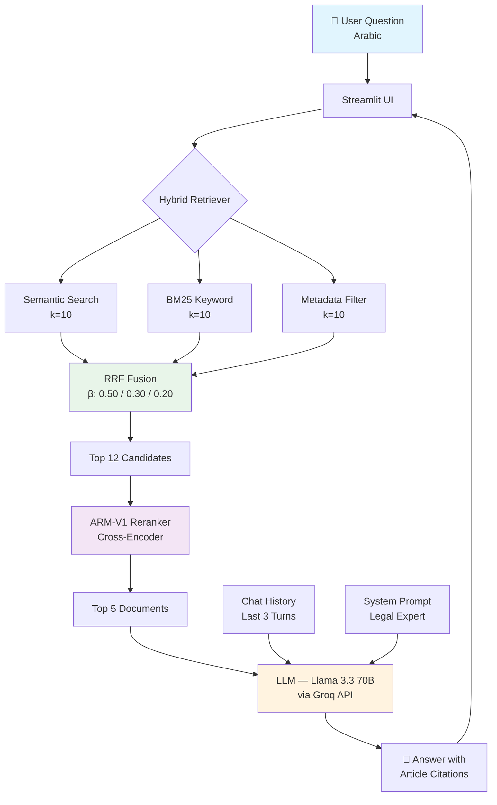

# ⚖️ Egyptian Legal AI Assistant

> **Multi-Law Arabic RAG Chatbot** — An advanced Retrieval-Augmented Generation system covering 6 Egyptian legal domains with hybrid search, cross-encoder reranking, and conversational memory.

[](https://python.org)
[](https://streamlit.io)
[](https://langchain.com)
[](https://groq.com)

---

## 📋 Table of Contents

- [Overview](#overview)
- [Problem & Solution](#problem--solution)
- [System Architecture](#system-architecture)
- [Legal Domains](#legal-domains)
- [Technology Stack](#technology-stack)
- [Project Structure](#project-structure)
- [Setup & Installation](#setup--installation)
- [Running the Application](#running-the-application)
- [Evaluation](#evaluation)
- [Architecture Deep Dive](#architecture-deep-dive)
- [Configuration Reference](#configuration-reference)
- [Observability with Phoenix](#observability-with-phoenix)
- [License](#license)

---

## Overview

This project is a **graduation project** that implements an AI-powered legal assistant for Egyptian law. Users can ask legal questions in Arabic, and the system retrieves relevant articles from 6 major Egyptian legal codes, reranks them for precision, and generates accurate answers using a large language model.

### Key Features

- **6 Egyptian Legal Domains** — Constitution, Civil Law, Labour Law, Personal Status, Technology Crimes, Criminal Procedures
- **Hybrid Retrieval** — Combines semantic search, BM25 keyword search, and metadata filtering via Reciprocal Rank Fusion (RRF)
- **Cross-Encoder Reranking** — Arabic-tuned ARM-V1 reranker for high-precision document selection
- **Conversational Memory** — Last 3 Q&A turns preserved for follow-up questions
- **A/B Embedding Comparison** — Switch between GATE-AraBert-v1 and Arabic-Triplet-Matryoshka-V2 via environment variable
- **Multi-Key Evaluation** — 4 Groq API keys with round-robin rotation for faster evaluation
- **Full Observability** — Optional Arize Phoenix tracing via OpenTelemetry

---

## Problem & Solution

### Problem

Egyptian citizens, law students, and legal practitioners often struggle to navigate the complex landscape of Egyptian legislation. With thousands of articles spread across multiple legal codes written in formal Arabic, finding the relevant provision for a specific question is time-consuming and requires specialized expertise.

### Solution

This system provides an **intelligent, conversational interface** that:

1. **Understands** Arabic legal questions with semantic awareness
2. **Retrieves** the most relevant articles from a structured knowledge base
3. **Ranks** results using a cross-encoder model fine-tuned for Arabic
4. **Generates** accurate, citation-backed answers using Llama 3.3 70B
5. **Remembers** context from previous turns for natural conversation flow

---

## System Architecture



---

## Legal Domains

| # | Domain | File | Articles | Description |
|---|--------|------|----------|-------------|
| 1 | 🏛️ Constitution | `Egyptian_Constitution_legalnature_only.json` | ~230 | The Egyptian Constitution (2014, amended 2019) |
| 2 | 📜 Civil Law | `Egyptian_Civil.json` | ~1000+ | Civil Code — contracts, obligations, property |
| 3 | 👷 Labour Law | `Egyptian_Labour_Law.json` | ~250+ | Labour regulations — employment, wages, disputes |
| 4 | 👨‍👩‍👧‍👦 Personal Status | `Egyptian_Personal Status Laws.json` | ~200+ | Family law — marriage, divorce, custody, inheritance |
| 5 | 💻 Technology Crimes | `Technology Crimes Law.json` | ~40+ | Cybercrime & IT-related offenses |
| 6 | ⚖️ Criminal Procedures | `قانون_الإجراءات_الجنائية.json` | ~500+ | Criminal procedure code — investigation, prosecution, trial |

All law files are stored in the `data/` directory as structured JSON with article-level metadata (article number, legal nature, source law name, etc.).

---

## Technology Stack

| Component | Technology | Details |
|-----------|-----------|---------|
| **LLM** | Groq — Llama 3.3 70B Versatile | `temperature=0.2`, `top_p=0.80`, low-latency inference |
| **Embeddings** | HuggingFace — GATE-AraBert-v1 | Arabic-optimized sentence embeddings |
| **Vector Store** | ChromaDB | Persistent local storage, per-model subfolders |
| **Retrieval** | Hybrid RRF | Semantic + BM25 + Metadata, parallel execution |
| **Reranker** | ARM-V1 (local) | Cross-encoder based on BAAI/bge-reranker-v2-m3 |
| **Framework** | LangChain 0.2+ | Chains, retrievers, prompt templates |
| **UI** | Streamlit | Arabic RTL support, chat interface |
| **Evaluation** | Ragas | Faithfulness, relevancy, precision, recall |
| **Observability** | Arize Phoenix + OpenTelemetry | Span-level tracing for debugging |
| **Language** | Python 3.10+ | Type hints throughout |

---

## Project Structure

```
📂 Chatbot_me/
├── 📄 app_final_updated.py          # Main Streamlit app (production)
├── 📄 app_final_pheonix.py          # Streamlit app + Phoenix tracing
├── 📄 evaluate_rag.py               # RAG evaluation with 4-key rotation
├── 📄 requirements.txt              # Python dependencies
├── 📄 README.md                     # This file
├── 📄 ragas_dataset_100.csv         # 100-question evaluation dataset
├── 📄 test_dataset_5_questions.json  # Small test dataset (5 questions)
├── 📄 .env                          # API keys (not committed)
├── 📄 .gitignore                    # Git ignore rules
│
├── 📂 data/                         # Law JSON files
│   ├── Egyptian_Civil.json
│   ├── Egyptian_Constitution_legalnature_only.json
│   ├── Egyptian_Labour_Law.json
│   ├── Egyptian_Personal Status Laws.json
│   ├── Technology Crimes Law.json
│   └── قانون_الإجراءات_الجنائية.json
│
├── 📂 reranker/                     # Local ARM-V1 cross-encoder model
│   ├── config.json
│   ├── model.safetensors
│   ├── tokenizer.json
│   ├── sentencepiece.bpe.model
│   └── ...
│
├── 📂 chroma_db/                    # ChromaDB persistent vector store
│
├── 📂 archive/                      # Archived/deprecated files
│   ├── app_final.py
│   ├── evaluate.py
│   └── ...
│
├── 📦 openinference_instrumentation_langchain-*.whl
└── 📦 openinference_instrumentation_openai-*.whl
```

---

## Setup & Installation

### Prerequisites

- **Python 3.10+**
- **Git**
- **Groq API key** — [Get one free at groq.com](https://console.groq.com)

### 1. Clone the Repository

```bash
git clone https://github.com/Ahmd-Mohmd/Chatbot_me.git
cd Chatbot_me
```

### 2. Create a Virtual Environment

```bash
python -m venv venv

# Windows
venv\Scripts\activate

# macOS/Linux
source venv/bin/activate
```

### 3. Install Dependencies

```bash
pip install -r requirements.txt
```

**Optional** — Install Phoenix tracing wheels (for `app_final_pheonix.py`):

```bash
pip install openinference_instrumentation_langchain-0.1.56-py3-none-any.whl
pip install openinference_instrumentation_openai-0.1.41-py3-none-any.whl
```

### 4. Configure Environment Variables

Create a `.env` file in the project root:

```env
GROQ_API_KEY=gsk_your_primary_key_here

# Additional keys for evaluation (optional, improves throughput)
groq_api=gsk_your_second_key
groq_api_2=gsk_your_third_key
groq_api_3=gsk_your_fourth_key

# A/B Embedding Switch (optional)
# EMBEDDING_MODEL=Omartificial-Intelligence-Space/Arabic-Triplet-Matryoshka-V2
```

---

## Running the Application

### Main App (Production)

```bash
streamlit run app_final_updated.py
```

Opens the chat interface at `http://localhost:8501`. The first run will:
1. Load and de-duplicate articles from all 6 law files
2. Create embeddings and store them in ChromaDB (takes ~5-10 min first time)
3. Load the ARM-V1 reranker model

Subsequent runs load from the ChromaDB cache and start much faster.

### App with Phoenix Tracing

```bash
# Start Phoenix collector first
python -m phoenix.server.main serve

# Then run the traced app
streamlit run app_final_pheonix.py
```

View traces at `http://localhost:6006`.

---

## Evaluation

The evaluation script uses **Ragas** to measure pipeline quality across 4 metrics.

### Metrics

| Metric | Description |
|--------|-------------|
| **Faithfulness** | Is the answer grounded in the retrieved context? |
| **Answer Relevancy** | Does the answer address the question? |
| **Context Precision** | Are the retrieved documents relevant to the question? |
| **Context Recall** | Do the retrieved documents cover the ground truth? |

### Run Evaluation

```bash
# Default: evaluates all 100 questions from ragas_dataset_100.csv
python evaluate_rag.py

# Custom dataset
python evaluate_rag.py path/to/questions.csv

# Via environment variable
set QA_FILE_PATH=ragas_dataset_100.csv
python evaluate_rag.py
```

### Multi-Key Throughput

The evaluation script loads **all 4 Groq API keys** from `.env` and rotates through them:

- **Single key**: ~30 RPM → ~45 min for 100 questions
- **4 keys**: ~120 RPM → ~15 min for 100 questions

If a key hits rate limits (429), the script automatically falls back to the next key.

### Output Files

| File | Contents |
|------|----------|
| `evaluation_results.json` | Average scores, per-category breakdown, config |
| `evaluation_breakdown.json` | Per-question scores and answers |
| `evaluation_detailed.json` | Raw questions, answers, and contexts |

---

## Architecture Deep Dive

### 1. Data Ingestion

Each law file is a JSON containing articles with metadata:
```json
{
  "article_number": "المادة 1",
  "article_text": "...",
  "legal_nature": "آمرة",
  "source_law_name": "القانون المدني المصري"
}
```

Articles are de-duplicated by `(source_law_key, article_number)` to avoid redundancy.

### 2. Embedding & Vector Store

Embeddings are generated using **GATE-AraBert-v1** (or the configured alternative) and stored in ChromaDB. Each embedding model gets its own subfolder (`chroma_db_gate-arabert-v1/` or `chroma_db_arabic-triplet-matryoshka-v2/`) to allow easy A/B comparison.

### 3. Hybrid Retrieval (RRF)

Three retrievers run **in parallel** using `ThreadPoolExecutor`:

| Retriever | Type | k | Weight (β) |
|-----------|------|---|-----------|
| Semantic | Vector similarity | 10 | 0.50 |
| BM25 | Keyword/token matching | 10 | 0.30 |
| Metadata | Legal-nature filter | 10 | 0.20 |

Results are fused using **Reciprocal Rank Fusion**:

$$RRF(d) = \sum_{r \in R} \frac{\beta_r}{K + \text{rank}_r(d)}$$

Where $K = 60$ (standard RRF constant). The top 12 fused documents proceed to reranking.

### 4. Cross-Encoder Reranking

The **ARM-V1** reranker (based on `BAAI/bge-reranker-v2-m3`, XLMRoberta architecture) scores each `(query, document)` pair and selects the **top 5** most relevant documents.

### 5. LLM Generation

**Groq's Llama 3.3 70B Versatile** generates the final answer with:
- `temperature = 0.2` — low randomness for legal accuracy
- `top_p = 0.80` — focused token sampling
- System prompt enforcing Arabic legal expert persona
- Chat history (last 3 turns) for contextual follow-ups

### 6. Chat History

The last 3 Q&A turns are formatted as `HumanMessage` / `AIMessage` pairs and injected via LangChain's `MessagesPlaceholder`. This enables:
- Follow-up questions ("ما هي عقوبته؟" after discussing a crime)
- Pronoun resolution ("هل ينطبق ذلك على...؟")
- Conversation continuity without re-stating context

---

## Configuration Reference

All constants are defined at the top of `app_final_updated.py`:

| Parameter | Default | Description |
|-----------|---------|-------------|
| `EMBEDDING_MODEL` | `GATE-AraBert-v1` | HuggingFace embedding model name |
| `SEMANTIC_K` | `10` | Semantic retriever top-k |
| `BM25_K` | `10` | BM25 retriever top-k |
| `METADATA_K` | `10` | Metadata retriever top-k |
| `RRF_K` | `60` | RRF fusion constant |
| `RRF_TOP_K` | `12` | Documents after RRF fusion |
| `BETA_SEMANTIC` | `0.50` | RRF weight — semantic |
| `BETA_BM25` | `0.30` | RRF weight — BM25 |
| `BETA_METADATA` | `0.20` | RRF weight — metadata |
| `RERANKER_TOP_N` | `5` | Documents after reranking |
| `LLM_MODEL` | `llama-3.3-70b-versatile` | Groq model identifier |
| `LLM_TEMPERATURE` | `0.2` | Generation temperature |
| `LLM_TOP_P` | `0.80` | Nucleus sampling threshold |
| `CHAT_HISTORY_TURNS` | `3` | Past Q&A turns to include |

---

## Observability with Phoenix

The `app_final_pheonix.py` variant adds **span-level tracing** via OpenTelemetry → Arize Phoenix:

| Span Name | What It Traces |
|-----------|---------------|
| `hybrid_retrieval` | All 3 parallel retrievers + RRF fusion |
| `reranker_compression` | Cross-encoder reranking |
| `chat_request` | Full chain invocation |
| `llm_generation` | Groq API call and response |

### Setup

```bash
# Install Phoenix
pip install arize-phoenix

# Start the collector
python -m phoenix.server.main serve

# Run the traced app
streamlit run app_final_pheonix.py
```

Dashboard: `http://localhost:6006`

---

## License

This project is a graduation project for the Faculty of Engineering. All Egyptian legal texts are public domain.

---

<div align="center">
  <b>Built with ❤️ for Egyptian Legal AI</b>
</div>
